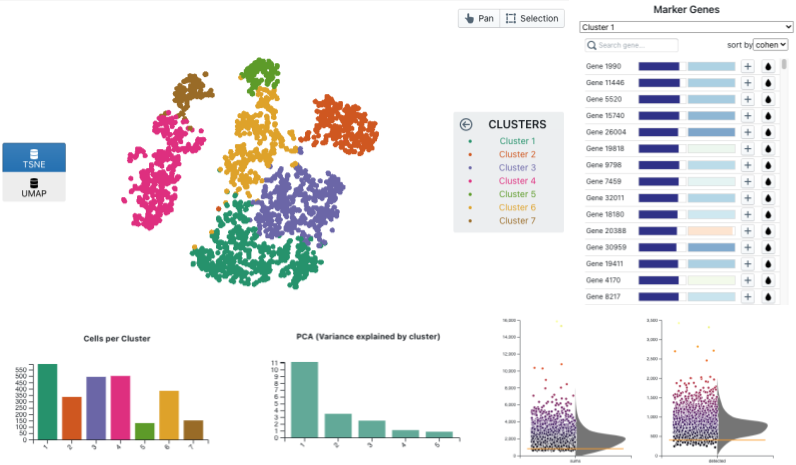

# SCRAN.JS.app - Single cell RNA-seq analysis in the Browser

## Overview

SCRAN.js is built on top of react and allows users to interactively analyze and explore single-cell RNA-seq (scRNA-seq) datasets in the browser. The app uses our underlying [**scran.js WASM library**](https://github.com/jkanche/scran.js) to effeciently perform various steps of the workflow parallely using Web Workers, thus speeding up interactive analysis and exploration.

***Note: Checkout [scran.js](https://github.com/jkanche/scran.js) for details on the implementation and the underlying WASM/C++ libraries that make this possible.***

***Note 2: This is a pure JS application with client side computation, neither the raw data not the results step of the analysis are uploaded or transfered to any servers. Everything automagically runs in your own browser!!!***


## What can you do ? 

- Upload a cellranger matrix market file (mtx, required) and optionally a genes/barcode files. *If a genes/barcode file is not uploaded, an index is automatically created.* 
- Once the files are accessible by the application, it automatically runs various steps in a scRNA-seq analysis - more details in [scran.js](https://github.com/jkanche/scran.js)
    - Explore QC Metrics (sums, detected and proportion)
    - Perform log-normalization and model gene mean-variance relationships
    - Compute PC's & explore variance explained by each PC
    - Construct a Nearest Neighbor search index
    - Perform Graph Clustering to identify clusters
    - Compute t-SNE and UMAP embeddings (these are spun off in parallel using web workers)
- The application unlocks various interactive exploratory features after a particular step in the analysis is successfully complete.
- Logs are available to checkout how long each step of the analysis took and any errors during the analysis



## Architecture

 (**scenario**) Traditionally we are more used to ***function shipping***, where a client (or an application in the browser) wants to perform an operation on a dataset. Since the server holds both the data and has better resources (historically), we make an API call to the server asking it to compute a function. The server responds with the results of the operation and the client/app displays them. 

Compared to the scenario described above the application replaces the server with the users's own laptop/machine. All computations performed by the app run in a web worker in the browser. This allows the main thread of the app to be less occupied and also makes the app more responsive. 


Single-cell datasets can be huge, so we also want to make sure we are not constantly serializing and transferring large chunks of data back and forth between the main thread and the workers. For various steps like t-SNE nd UMAP having access to shared memory that contains the nearest neighbor graph embeddings computes these operations faster. This is also a problem with the current limitation of [WASM (4gig memory limit)](https://v8.dev/blog/4gb-wasm-memory). To efficiently use memory we have to enable [Cross Original Isolation](https://web.dev/why-coop-coep/), so that workers have access to shared array buffers. A caveat of this approach is described in the [Gotchas](#Gotchas) section below. A workaround for this is by using Service Workers.
## Developer notes

Install dependencies

```
npm install or yarn # depending on what you use
```

To start the app,

```
yarn start # if using yarn, highly recommended
npm run start # if using npm
```

usually runs on port 3000 unless something else is already running on the same port.

This project was bootstrapped with [Create React App](https://github.com/facebook/create-react-app).

# Gotchas

## CrossOriginIsolation

Currently the app uses service-workers to enable cross origin isolation. This allows us to use sharedArrayBuffers and [pthreads](https://emscripten.org/docs/porting/pthreads.html)!

One caveat of this process is since a service-worker caches the resources and loads these blobs, the generated js bindings from emscripten does not understand this. This is usually not a problem, but turns out to be problem when using service workers.

https://github.com/emscripten-core/emscripten/issues/14089

We manually modified the emscripten generated scran.js file with one of the solution here -

replace these in the generate js bindings

```
worker.postMessage({
    "cmd": "load",
    <!-- we are mostly updating the line below -->
    "urlOrBlob": Module["mainScriptUrlOrBlob"] || (self.location.origin + "/scran/scran.js"),
    "wasmMemory": wasmMemory,
    "wasmModule": wasmModule
})
```
